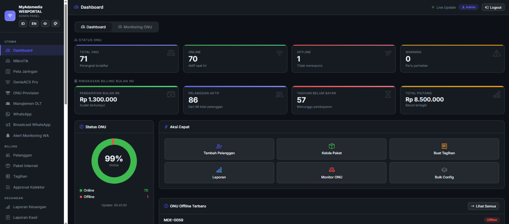

# RTRWNET Management & Billing System



Sistem manajemen ISP yang mengintegrasikan **penagihan**, **GenieACS**, **OLT (SNMP)**, **MikroTik** (PPPoE/hotspot/voucher), **peta jaringan (GIS)**, **inventaris**, **WhatsApp/Telegram**, dan **multi-portal** (admin, teknisi, pelanggan, agen) dalam satu platform.

[](https://github.com/alijayanet/billing-rtrw/blob/main/LICENSE)
[](https://github.com/alijayanet/billing-rtrw/stargazers)
[](https://nodejs.org/)

---

## Daftar fitur (sesuai modul di aplikasi)

### Peta jaringan & geografis
- **Koordinat kantor / pusat peta**: `office_lat` dan `office_lng` di `settings.json` menjadi titik acuan peta.
- **Peta admin** (`/admin/map`): **Leaflet** dengan basemap **OpenStreetMap** dan **satelit (hybrid)**; marker **pelanggan** dan **ODP**; garis hubung pelanggan–ODP; penyimpanan **jalur kabel** (polyline) per pelanggan; popup detail, status paket, dan **grafik/trafik PPPoE** (real-time dari MikroTik saat online).
- **Peta teknisi** (`/tech/map`): tampilan geografis pelanggan & ODP, garis ke ODP, popup dengan **chat WhatsApp** dan **buka rute di Google Maps**; opsi **lokasi GPS** perangkat teknisi di peta.
- **Pemilih lokasi di form pelanggan**: dialog peta (satelit) untuk mengisi **latitude/longitude** saat tambah/edit data pelanggan.

### Billing, tagihan & pembayaran
- **Promo & prorata (per paket)**: harga promo untuk **N siklus tagihan pertama** per pelanggan (`promo_price` + `promo_cycles` di paket; counter `promo_cycles_used` di pelanggan, di-reset saat **ganti paket**). **Prorata** untuk **invoice pertama** bila tanggal pasang (`install_date`) jatuh di **bulan yang sama** dengan periode tagihan dan opsi prorata diaktifkan di paket (proporsi sisa hari dalam bulan). Rincian ditulis di kolom catatan invoice (`AUTO: …`).
- **Admin — alat billing**: **Reset siklus promo** (tombol di daftar pelanggan, hanya admin) mengembalikan `promo_cycles_used` ke 0. **Susulan prorata bulan pasang** membuat satu invoice untuk **bulan kalender tanggal pasang** jika belum ada, dengan nominal prorata dari **harga reguler** (bukan promo), untuk menutup kasus tagihan bulan pasang yang terlewat.
- Generate tagihan **per pelanggan** atau **massal**; status lunas/belum bayar; cetak invoice; batalkan pembayaran (unpay) jika diperlukan.
- **Bayar tunggal / bayar massal** dari panel admin; integrasi pembayaran online: **Midtrans**, **Tripay**, **Xendit**, **Duitku** (aktif/nonaktif lewat `settings.json`).
- **Notifikasi WhatsApp pelanggan saat tagihan dibayar**: otomatis terkirim ketika invoice ditandai lunas melalui **agent**, **admin**, **kasir**, atau **approval kolektor** (jika fitur WhatsApp diaktifkan).
- **QRIS / nominal unik**: penugasan & pembersihan kode unik invoice; cocokkan pembayaran dari notifikasi.
- **Webhook pembayaran generik**: endpoint `POST /api/webhook/v1/payment-notif` (dengan `MY_WEBHOOK_SECRET` di `.env`) untuk mencatat notifikasi teks bank/e-wallet dan **otomatis menandai lunas** jika nominal cocok dengan tagihan unik; log tampilan & pembersihan di admin.
- Callback/redirect pembayaran dari portal pelanggan; halaman **isolir** statis `/isolated` (mis. untuk redirect dari MikroTik).

### MikroTik & jaringan
- **Multi-router**: daftar router MikroTik, tes koneksi, **setup firewall** bawaan, pemilihan router per pelanggan.
- Dukungan **RouterOS 7** (menggunakan client API yang kompatibel untuk menghindari error balasan `!empty` pada library lama).
- **PPPoE**: profil, user/secret, sesi aktif, **monitor trafik**; **jam kalong** (ganti profil malam/hari lewat cron); **FUP** (ganti profil saat pemakaian bulanan melewati batas paket).
- **Pencatatan pemakaian (usage)**: sinkron periodik dari counter sesi PPPoE ke database (dapat dimatikan lewat pengaturan `usage_tracking_enabled`).
- **Hotspot**: profil user, user hotspot, sesi aktif hotspot.
- **Voucher hotspot**: template voucher, **batch** generate, sinkron ke MikroTik, cetak batch, export **CSV**, hapus batch.
- **Backup konfigurasi** MikroTik dari panel.

### GenieACS (TR-069 / perangkat pelanggan)
- Daftar perangkat, detail per **tag**; ubah **SSID** / **password Wi‑Fi**, **reboot** CPE; operasi **bulk SSID**.
- Integrasi ke data pelanggan (tag GenieACS) untuk monitoring dari admin/teknisi.

### OLT PON (SNMP)
- Manajemen **OLT** (host, community SNMP, port, merek, kredensial web/Telnet, opsional **port Telnet** & **password enable** ZTE, opsional **API Base URL** untuk delegasi ke [go-api-c320](https://github.com/s4lfanet/go-api-c320)).
- **Statistik ONU** per port; aksi **reboot ONU**, **rename**, **otorisasi ONU**, **konfigurasi WAN** (Telnet OMCI, TR069 GenieACS, atau **REST go-api** untuk ZTE: `POST /api/v1/vlan/onu` — bridge/VLAN; PPPoE tetap Telnet/TR069).

### ODP & infrastruktur pasif
- CRUD **ODP** (titik distribusi) dengan koordinat; ditampilkan di peta bersama pelanggan.

### Pelanggan & data
- CRUD pelanggan: paket, PPPoE, profil isolir, **hari isolir per pelanggan**, **isolir otomatis** per pelanggan, tag GenieACS, **tipe koneksi** / ODP / koordinat.
- **Isolir / buka isolir** manual dari admin (sinkron ke MikroTik).
- **Ekspor** daftar pelanggan; **impor** dari berkas (Excel) dengan upload.
- **Bulk tools** untuk operasi terhadap banyak peranggan/perangkat sekaligus.

### Paket layanan
- CRUD paket harga, kecepatan, deskripsi; opsi **jam kalong** (profil malam); opsi **FUP** (batas GB + profil turun kecepatan).

### Inventaris (gudang)
- Kategori & item; penyesuaian stok; peringatan stok rendah (sesuai implementasi di panel).

### Tiket dukungan
- Daftar tiket (admin); pelanggan dapat **membuat tiket** dari portal; teknisi **ambil tiket** dan **update** penanganan.

### Laporan & dashboard
- Laporan keuangan/agregasi di panel admin; dashboard ringkasan (sesuai halaman utama admin).

### Monitoring & kesehatan sistem
- Halaman **monitoring** (admin/teknisi): CPU, RAM, disk, konektivitas ke layanan terkait.
- API **`/health`** (publik ringan) dan API metrik/stats untuk panel.

### WhatsApp (Baileys)
- Status koneksi, **broadcast** massal dengan jeda/antrian, jeda/lanjut/stop broadcast.
- Pengaturan **pengingat tagihan otomatis** (template pesan + jadwal via cron).
- Tes notifikasi, reset sesi autentikasi bot; integrasi ke tagihan (kirim info invoice via WhatsApp).
- Perintah via WhatsApp:
  - **Admin**: menu admin, billing tools, Mikrotik tools, **topup saldo agent**.
  - **Agent**: cek status transaksi.

### Telegram (opsional)
- Bot admin (aktifkan di `settings.json`); sinkronisasi dari panel bila tersedia.

### Manajemen pengguna internal
- **Super admin / admin / kasir**: sesi terpisah; pembatasan aksi sensitif untuk peran tertentu (`restrictToAdmin`).
- **Teknisi**: akun terpisah, area tugas.
- **Kasir**: akun untuk operasi kasir.
- **Kolektor**: akun untuk **cek tagihan pelanggan** (lunas/belum), buat **pengajuan pembayaran** yang menunggu approval admin/kasir.
- **Audit log**: riwayat aktivitas sensitif (super admin).

### Agen / mitra penjualan
- Portal agen: **bayar tagihan** pelanggan (uang saldo agen), **jual voucher**, **cetak struk** transaksi.
- Admin: kelola agen, **top-up saldo**, **harga khusus** per agen, laporan agen.

### Portal pelanggan (self-service)
- Halaman informasi: **syarat & ketentuan**, **privasi**, **tentang**, **kontak**.
- **Cek tagihan** tanpa login (nomor/ID sesuai alur di aplikasi).
- **Registrasi** pelanggan baru (online); login; opsi **login OTP** bila diaktifkan di pengaturan.
- **Dashboard**: status layanan, tagihan, pembayaran; **grafik/trafik PPPoE** untuk akun sendiri.
- Ubah **SSID / password Wi‑Fi**, **reboot** CPE, ubah identitas/tag perangkat (sesuai kebijakan yang diaktifkan).
- **Beli voucher** (publik/halaman voucher) dengan alur pembayaran.
- Buat **tiket** keluhan ke provider.

### Portal teknisi
- Ringkasan tugas, **pool** tiket, **riwayat** penanganan.
- **Peta jaringan** (lihat bagian peta).
- **Monitoring** sistem.
- **Input pelanggan baru** dari lapangan (dengan bantuan API MikroTik & ODP/port).
- Akses ringkas ke **perangkat GenieACS** (detail, SSID, password, reboot) untuk pelanggan yang ditangani.

### Otomatisasi terjadwal (cron)
- Tanggal **1 jam 00:01**: generate **tagihan bulanan**.
- Setiap hari **jam 02:00**: **isolir otomatis** pelanggan aktif yang lewat jatuh tempo/isolir (sesuai hari & flag per pelanggan).
- **Jam 09:00**: pengingat tagihan via **WhatsApp** (H-1 dari hari isolir, jika fitur diaktifkan).
- **00:00 & 06:00**: **jam kalong** — ganti profil PPPoE malam/siang untuk paket yang mengaktifkannya.
- Setiap **10 menit**: **sinkron pemakaian data** dari sesi **PPPoE aktif** di MikroTik (jika tracking diaktifkan).
- Setiap **jam**: pengecekan **FUP** dan penurunan profil bila kuota habis.

### Backup & pemeliharaan
- **Backup & restore** database dari panel admin; pembersihan file backup lama.
- **Jalur update** (halaman update + eksekusi skrip) untuk pemeliharaan server (sesuai implementasi `update.sh` / panel).

### Bahasa antarmuka (i18n)
- Pilihan bahasa lewat **query `?lang=`**, sesi, atau pintasan **`/lang/:lang`**; berkas teks di folder `locales/`.

---

## Ringkasan tech stack

- **Runtime**: Node.js **≥ 20** (disarankan LTS terbaru 20.x)
- **Backend**: Express.js
- **Database**: SQLite lewat **better-sqlite3** (file utama: `database/billing.db` — dibuat/dimigrasi otomatis saat pertama jalan)
- **Tampilan**: EJS, Bootstrap 5, Bootstrap Icons
- **Peta**: Leaflet + tile OpenStreetMap / satelit (Google hybrid) di panel admin & teknisi
- **Integrasi**: GenieACS REST API, MikroTik RouterOS API, SNMP (`net-snmp`) untuk OLT, Baileys (WhatsApp), bot Telegram (opsional), gateway pembayaran (sesuai konfigurasi), parsing spreadsheet (**xlsx**) untuk impor data

---

## Instalasi

### Prasyarat
- Node.js **20 atau lebih baru** (`engines` di `package.json`)
- Akses jaringan ke GenieACS / MikroTik jika fitur tersebut dipakai

### Langkah

```bash
git clone https://github.com/alijayanet/billing-rtrw.git
cd billing-rtrw
npm install
```

### Konfigurasi

1. Salin atau edit **`settings.json`** di root proyek: URL GenieACS, kredensial MikroTik, `session_secret`, kredensial admin default, gateway pembayaran, WhatsApp/Telegram, dan **`server_port`** / **`server_host`**.
2. **Penting untuk produksi**: Ganti password admin default, `session_secret`, dan API key; batasi akses file konfigurasi di server.
3. Variabel lingkungan opsional: file **`.env`** (mis. `NODE_ENV=production`) — lihat penggunaan di kode jika Anda menambah secret di `.env`.

### Menjalankan aplikasi

```bash
npm start
```

Mode pengembangan (auto-restart dengan nodemon):

```bash
npm run dev
```

Entry point aplikasi adalah **`app-customer.js`** (bukan `app.js`).

### PM2 (proses daemon)

```bash
npm install pm2 -g
pm2 start app-customer.js --name billing-rtrw
```

---

## Menjalankan Pengujian (Testing)

Untuk menjamin keandalan fungsionalitas kritis (utilitas enkripsi, validator konfigurasi, parser script MikroTik, dan helper keamanan), proyek ini dilengkapi dengan unit test berbasis **Jest** yang memiliki coverage 100% untuk modul-modul kritis tersebut.

Menjalankan seluruh test suite:
```bash
npm test
```

Menjalankan pengujian ketat dengan ambang batas coverage 100% (branches, functions, lines, statements):
```bash
npm run test:cov
```

---

## Panduan Deployment Produksi

Berikut adalah langkah-langkah terperinci untuk mendesain dan men-deploy aplikasi ini pada server produksi berbasis Linux (seperti Ubuntu, Debian, atau Armbian):

### 1. Pemasangan Node.js LTS
Pastikan runtime Node.js versi LTS terbaru sudah terinstal pada sistem:
```bash
curl -fsSL https://deb.nodesource.com/setup_20.x | sudo -E bash -
sudo apt-get install -y nodejs build-essential
```

### 2. Konfigurasi Lingkungan Produksi
- Pastikan Anda mengatur file `.env` di root proyek untuk mengamankan enkripsi:
  ```env
  NODE_ENV=production
  SETTINGS_MASTER_KEY=kunci-master-enkripsi-anda-yang-sangat-rahasia-dan-panjang
  ```
- Perbarui file `settings.json` dan ubah nilai default `admin_password`, `session_secret`, serta `admin_api_key` dengan kombinasi string acak yang kuat.

### 3. Konfigurasi Proses Latar Belakang (Daemon) dengan PM2
PM2 digunakan untuk menjaga proses aplikasi agar tetap berjalan di latar belakang dan melakukan restart secara otomatis apabila terjadi crash.

1. Install PM2 secara global:
   ```bash
   sudo npm install pm2 -g
   ```
2. Jalankan aplikasi menggunakan PM2:
   ```bash
   pm2 start app-customer.js --name billing-rtrw --time
   ```
3. Simpan daftar proses aktif dan atur script startup agar PM2 otomatis berjalan setelah sistem reboot/booting:
   ```bash
   pm2 save
   pm2 startup
   ```
   *Salin dan jalankan perintah terminal (sudo env PATH...) yang dihasilkan dari command startup tersebut.*

### 4. Konfigurasi Nginx sebagai Reverse Proxy & SSL (HTTPS)
Direkomendasikan menggunakan Nginx untuk melayani trafik dari port standard HTTP/HTTPS (80/443) ke port internal aplikasi (default: 3001) dan memasang SSL Certificate gratis dari Let's Encrypt.

1. Pasang Nginx dan Certbot:
   ```bash
   sudo apt update
   sudo apt install nginx certbot python3-certbot-nginx -y
   ```
2. Buat file konfigurasi server block baru, misalnya `/etc/nginx/sites-available/billing.myadamedia.com`:
   ```nginx
   server {
       listen 80;
       server_name billing.myadamedia.com; # Sesuaikan dengan domain/subdomain Anda

       location / {
           proxy_pass http://localhost:3001; # Port internal settings.json
           proxy_http_version 1.1;
           proxy_set_header Upgrade $http_upgrade;
           proxy_set_header Connection 'upgrade';
           proxy_set_header Host $host;
           proxy_cache_bypass $http_upgrade;
           proxy_set_header X-Real-IP $remote_addr;
           proxy_set_header X-Forwarded-For $proxy_add_x_forwarded_for;
           proxy_set_header X-Forwarded-Proto $scheme;
       }

       # Khusus untuk ACS TR-069 Server (mengizinkan koneksi ONU/CPE secara real-time)
       location /acs {
           proxy_pass http://localhost:3001/acs;
           proxy_http_version 1.1;
           proxy_set_header Host $host;
           proxy_set_header X-Real-IP $remote_addr;
           proxy_set_header X-Forwarded-For $proxy_add_x_forwarded_for;
           proxy_read_timeout 600s;
       }
   }
   ```
3. Aktifkan konfigurasi virtual host dan restart service Nginx:
   ```bash
   sudo ln -s /etc/nginx/sites-available/billing.myadamedia.com /etc/nginx/sites-enabled/
   sudo nginx -t
   sudo systemctl restart nginx
   ```
4. Dapatkan sertifikat SSL Let's Encrypt secara gratis dan otomatis melalui Certbot:
   ```bash
   sudo certbot --nginx -d billing.myadamedia.com
   ```

### 5. Pengaturan Tugas Cadangan Database (Auto-Backup)
SQLite menyederhanakan backup data karena semua data tersimpan di satu file. Anda dapat menggunakan cron job bawaan sistem Linux untuk mem-backup berkas database secara berkala.

1. Buka konfigurasi crontab:
   ```bash
   crontab -e
   ```
2. Tambahkan perintah berikut di bagian bawah untuk menduplikasi database setiap pukul 02:00 pagi ke folder cadangan:
   ```cron
   0 2 * * * cp /path/to/myadamedia-billing/database/billing.db /path/to/backups/billing_$(date +\%F).db
   ```

---

## Built-in ACS (TR-069)

Aplikasi ini dilengkapi dengan **Built-in ACS (Auto Configuration Server)** internal berbasis protokol TR-069/CWMP. Fitur ini memungkinkan aplikasi mengelola perangkat ONU/CPE secara langsung tanpa memerlukan server GenieACS eksternal (sangat menghemat resource server/VPS Anda).

### Fitur & Keuntungan:
- **Lightweight / Ringan**: Berjalan langsung di dalam proses Node.js aplikasi billing (tidak perlu MongoDB/Redis/GenieACS terpisah).
- **Kompatibilitas Luas**: Mendukung monitoring redaman (RX Power/Optical Signal), ganti SSID/password Wi-Fi, reboot, serta provision WAN untuk berbagai macam brand ONU di pasaran (termasuk ZTE, Huawei, FiberHome, VSOL, C-Data, China Mobile, China Telecom, China Unicom, dll).
- **Pengambilan Otomatis**: Otomatis mendeteksi detail perangkat saat bootstrap.

### Konfigurasi di Aplikasi:
Pastikan parameter berikut sudah diset ke `true` di file `settings.json`:
```json
"use_builtin_acs": true
```

### Konfigurasi TR-069 di ONU (CPE):
Pada halaman admin panel ONU Anda, arahkan konfigurasi TR-069 ke URL built-in ACS:

* **ACS URL**: `http://[IP-SERVER-BILLING]:[PORT-BILLING]/acs`
  * *Contoh*: `http://192.168.1.100:3001/acs` *(Sesuaikan IP dengan IP server Anda dan port dengan `server_port` di `settings.json`)*
* **ACS Username**: *(Bisa dikosongkan atau diisi sembarang)*
* **ACS Password**: *(Bisa dikosongkan atau diisi sembarang)*
* **Periodic Inform**: `Enable` (Aktifkan)
* **Periodic Inform Interval**: `300` atau `600` detik (disarankan 5 - 10 menit)
* **Connection Request Username**: *(Bisa dikosongkan / dibaca otomatis oleh sistem)*
* **Connection Request Password**: *(Bisa dikosongkan / dibaca otomatis oleh sistem)*

---

## Akses portal (setelah server jalan)

Port mengikuti **`server_port`** di `settings.json` (default **3001**). Ganti `[IP-SERVER]` dengan IP atau hostname mesin Anda.

| Portal | URL contoh |
|--------|------------|
| Beranda | `http://[IP-SERVER]:3001/` → mengarah ke login pelanggan |
| Pelanggan | `http://[IP-SERVER]:3001/customer/login` (alias singkat: `/login`) |
| Admin | `http://[IP-SERVER]:3001/admin/login` |
| Teknisi | `http://[IP-SERVER]:3001/tech/login` |
| Agen | `http://[IP-SERVER]:3001/agent/login` |
| Kolektor | `http://[IP-SERVER]:3001/collector/login` |
| Health check | `http://[IP-SERVER]:3001/health` |

Kredensial admin **awal** biasanya sesuai `admin_username` / `admin_password` di `settings.json` (contoh bawaan sering `admin` / `admin123`) — **wajib diganti** sebelum dipakai publik.

---

## Catatan platform

- **Linux (Ubuntu / Armbian)**: pola di atas langsung dipakai.
- **Windows**: sama (`npm install` / `npm start`); pastikan Node 20+ dan firewall mengizinkan port yang dipakai aplikasi.

---

## Troubleshooting

### Error: "no such column: hotspot_username"

Jika Anda mendapat error ini di server produksi, artinya database belum memiliki kolom-kolom baru yang ditambahkan. Solusi:

**Opsi 1: Jalankan Script Fix (Recommended)**

```bash
cd /path/to/billing-rtrw
bash scripts/fix-database.sh
```

Script akan otomatis:
- Backup database
- Menambahkan kolom yang hilang
- Memberikan instruksi restart aplikasi

**Opsi 2: Restart Aplikasi**

Jika file `config/database.js` sudah ter-update, cukup restart:

```bash
pm2 restart all
# atau
npm restart
```

**Opsi 3: Manual Verification**

```bash
cd /path/to/billing-rtrw
node scripts/verify-database.js
```

Lihat dokumentasi lengkap di **`FIX_DATABASE_COLUMNS.md`**

### Login Pelanggan Lambat

Aplikasi sudah dioptimasi untuk login cepat dengan:
- Lazy loading CSS & Icons
- Parallel database queries
- Service worker caching

Jika masih lambat, periksa:
- Koneksi internet ke CDN Bootstrap
- Performa server (CPU/RAM)
- Ukuran database (vacuum jika perlu)

### Hotspot Users Lambat Ditampilkan

Optimasi yang sudah diterapkan:
- Cache 15 detik untuk hotspot users
- Batch rendering untuk dataset besar
- Map-based lookup untuk sesi aktif

Jika masih lambat:
- Kurangi jumlah user hotspot yang tidak aktif
- Upgrade RouterOS ke versi terbaru
- Pertimbangkan split router jika user > 1000

---

## Integrasi WhatsApp Gateway Eksternal (Gratis & Stabil)

Aplikasi ini mendukung dua tipe modul WhatsApp Gateway:
1. **Lokal (Baileys In-App):** Bot WhatsApp berjalan di dalam proses Node.js aplikasi billing utama. Cocok untuk pengujian cepat.
2. **Eksternal (Evolution API / WAHA / Wuzapi):** Logika koneksi WhatsApp didecouple (dipisahkan) ke layanan terpisah berbasis Docker/API. **Sangat direkomendasikan untuk lingkungan produksi** karena menghindari memory leaks, mencegah disorientasi sesi akibat restart aplikasi billing, dan lebih aman dari resiko nomor WhatsApp diblokir.

### 1. Panduan Deployment WAHA (Rekomendasi Utama - Anti-Banned)
WAHA (WhatsApp HTTP API) menjalankan browser Chromium tersembunyi (*headless*) untuk mengoperasikan WhatsApp Web resmi. Metode ini meniru perilaku browser asli sehingga sangat meminimalisir risiko banned oleh Meta.

Buat berkas `docker-compose.yml` pada server Anda:
```yaml
version: '3.8'

services:
  waha:
    image: devlikeapro/waha:latest
    container_name: waha
    ports:
      - "3000:3000"
    environment:
      # Kunci API kustom Anda untuk keamanan
      - WHATSAPP_API_KEY=KunciApiKustomAndaYangSangatAman123
      # Menggunakan engine WEBJS (browser Chromium)
      - WHATSAPP_DEFAULT_ENGINE=WEBJS
    restart: always
```

Jalankan container tersebut:
```bash
docker compose up -d
```

### 2. Panduan Deployment Evolution API (Alternatif)
Evolution API adalah gateway multi-instance berbasis Baileys protobuf (socket-based) yang sangat hemat memori (RAM).

Buat berkas `docker-compose.yml` pada server Anda:
```yaml
version: '3.8'

services:
  evolution-api:
    image: atendareceitas/evolution-api:latest
    container_name: evolution-api
    ports:
      - "8080:8080"
    environment:
      - SERVER_PORT=8080
      - SERVER_URL=http://localhost:8080
      - AUTH_API_KEY=KunciApiKustomAndaYangSangatAman123
    volumes:
      - evolution_store:/evolution/store
    restart: always

volumes:
  evolution_store:
```

Jalankan container:
```bash
docker compose up -d
```

### 3. Mengkonfigurasi Billing System
Edit berkas `settings.json` atau gunakan UI panel pengaturan admin untuk memperbarui parameter berikut:

```json
  "whatsapp_gateway_type": "external",
  "whatsapp_gateway_url": "http://localhost:3000", // Isi port 3000 untuk WAHA, atau 8080 untuk Evolution
  "whatsapp_gateway_apikey": "KunciApiKustomAndaYangSangatAman123",
  "whatsapp_gateway_instance": "default" // Gunakan 'default' untuk WAHA, atau nama instance Anda untuk Evolution
```

*Catatan: Klien gateway system secara otomatis mendeteksi format payload untuk **Evolution API** dan **WAHA** berdasarkan URL dan nama instance.*

### 4. Fitur Auto-Start Gateway Latar Belakang (Tanpa Docker)
Jika Anda men-deploy sistem secara lokal tanpa Docker, Anda dapat mengaktifkan fitur **Auto-Start** agar WAHA atau Evolution API otomatis menyala di latar belakang saat aplikasi penagihan utama dijalankan.

**Langkah-langkah:**
1. Unduh salah satu repositori gateway pilihan Anda dan letakkan di dalam folder root billing dengan nama folder `waha` atau `evolution-api`:
   ```text
   d:\BILLING FIX\myadamedia-billing\
   ├── app-customer.js
   ├── package.json
   ├── waha\           <-- Jika menggunakan WAHA (Otomatis dideteksi pertama)
   └── evolution-api\   <-- Jika menggunakan Evolution API
   ```
2. Buka terminal/command prompt, masuk ke subfolder gateway yang Anda pilih, pasang dependensi, dan lakukan build:
   ```bash
   # Contoh jika menggunakan WAHA:
   cd waha
   npm install
   npm run build
   ```
3. Setel pengaturan di `settings.json` penagihan agar `whatsapp_gateway_url` mengarah ke `localhost` atau `127.0.0.1` dengan port yang sesuai (`http://localhost:3000` untuk WAHA, atau `http://localhost:8080` untuk Evolution).
4. Saat Anda menjalankan aplikasi penagihan (`npm start` atau `npm run dev`), sistem akan mendeteksi folder tersebut dan otomatis men-spawn gateway Anda di latar belakang. Bila sistem penagihan dimatikan (SIGINT/SIGTERM/exit), proses gateway juga akan otomatis dihentikan secara bersih.

---

## Kontribusi

Fork, buat branch fitur, lalu kirim Pull Request.

## Lisensi

**ISC** — lihat berkas `LICENSE`.

Dibuat untuk operasional ISP lokal & RTRW-Net.  
Managed by [Ali Jaya Net](https://github.com/alijayanet)

## Info & donasi

081947215703 — https://wa.me/6281947215703
