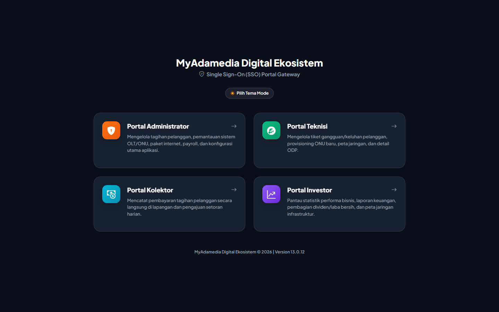
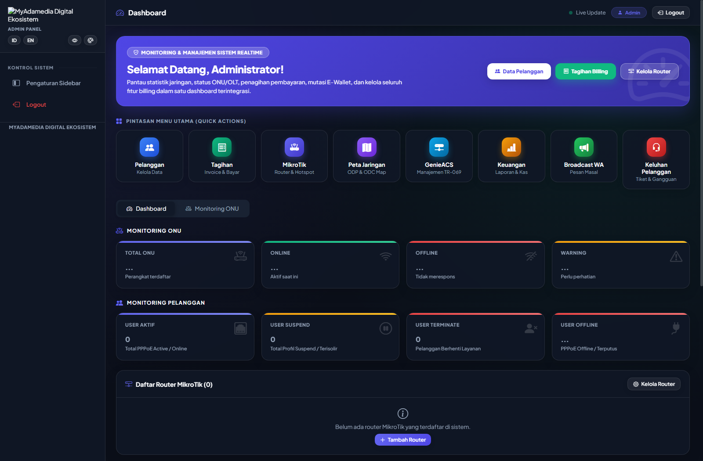
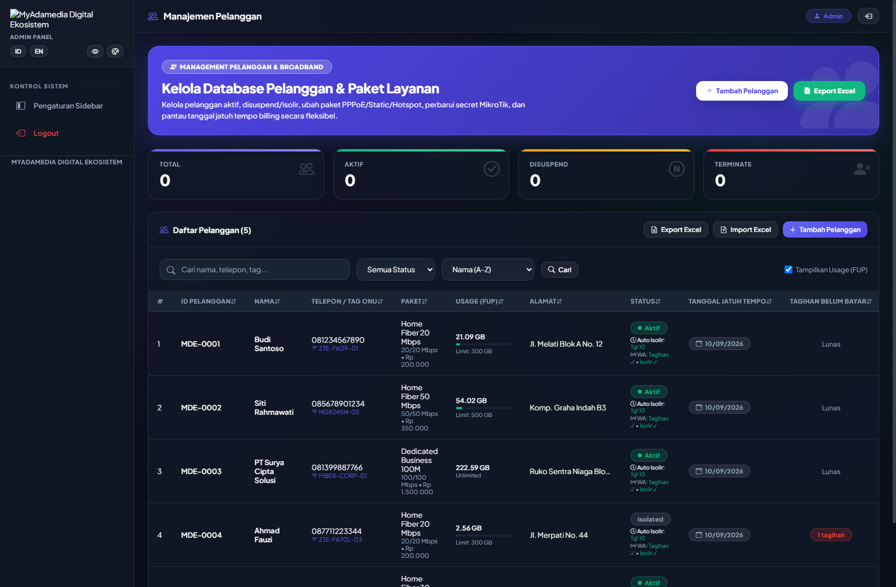
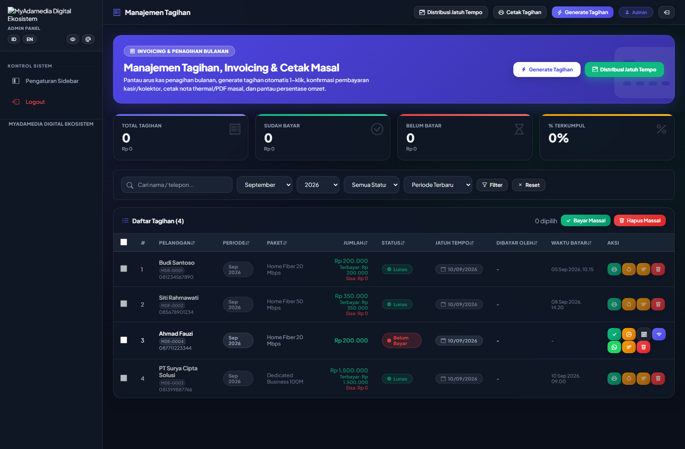
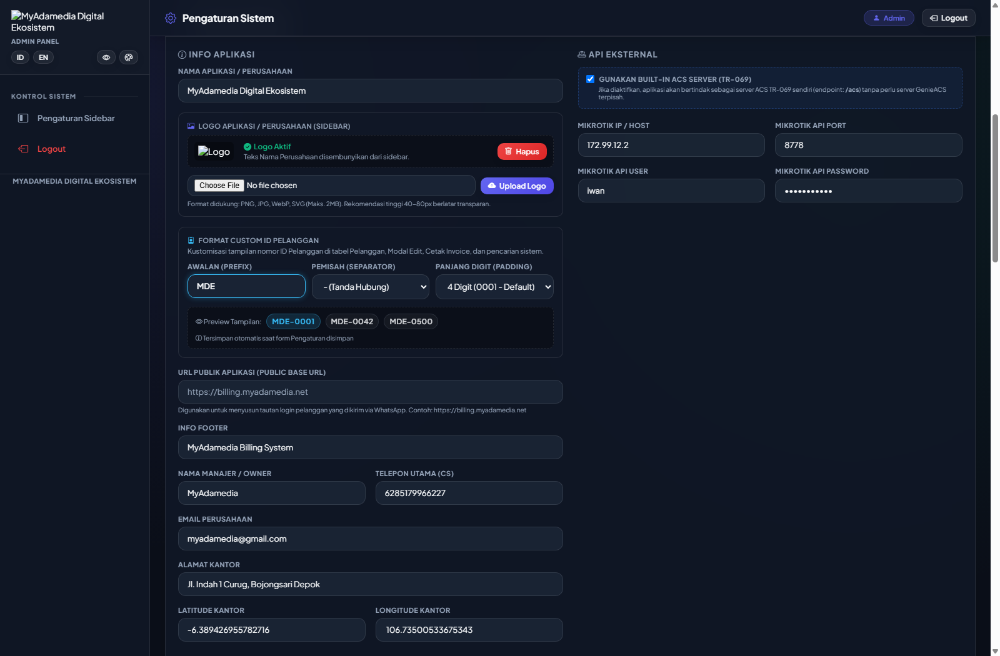
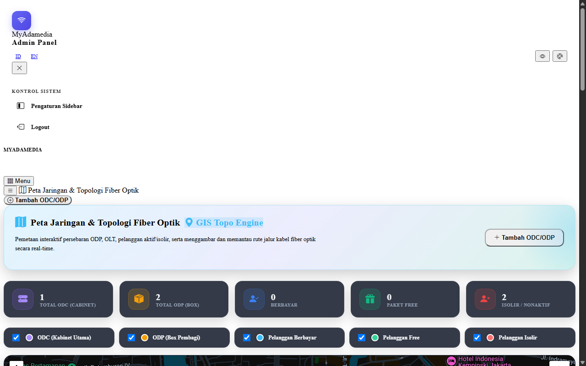

# PROPOSAL PENAWARAN & KEMITRAAN BISNIS
## IMPLEMENTASI SISTEM MANAJEMEN ISP & AUTOMATED BILLING ENGINE
### **MyAdamedia Billing System — Enterprise Edition**

---

**Nomor Dokumen:** PROP-MAB/2026/09-01  
**Tanggal Penerbitan:** 12 September 2026  
**Klasifikasi:** Proposal Penawaran Komersial & Solusi Bisnis  
**Disusun Oleh:** Tim Solusi & Pengembangan Perangkat Lunak MyAdamedia  
**Ditujukan Kepada:** Pimpinan Perusahaan, Manajemen ISP, & Pengelola Jaringan RT/RW Net  

---

## DAFTAR ISI
1. [Ringkasan Eksekutif (Executive Summary)](#1-ringkasan-eksekutif-executive-summary)
2. [Latar Belakang & Tantangan Pengelolaan ISP Modern](#2-latar-belakang--tantangan-pengelolaan-isp-modern)
3. [Solusi Strategis: MyAdamedia Billing System](#3-solusi-strategis-myadamedia-billing-system)
4. [Arsitektur & Modul Unggulan Aplikasi](#4-arsitektur--modul-unggulan-aplikasi)
   - 4.1. [Portal Akses Terpadu (Single Sign-On Multi-Role)](#41-portal-akses-terpadu-single-sign-on-multi-role)
   - 4.2. [Dashboard Eksekutif & Monitoring Finansial Real-Time](#42-dashboard-eksekutif--monitoring-finansial-real-time)
   - 4.3. [Manajemen Pelanggan & Fleksibilitas Custom ID](#43-manajemen-pelanggan--fleksibilitas-custom-id)
   - 4.4. [Billing Engine Otomatis, Invoicing & Multi-Payment Gateway](#44-billing-engine-otomatis-invoicing--multi-payment-gateway)
   - 4.5. [Pusat Pengaturan Sistem & Kustomisasi Identitas](#45-pusat-pengaturan-sistem--kustomisasi-identitas)
   - 4.6. [Pemetaan Infrastruktur Jaringan Fiber Optik (GIS ODP & ODC)](#46-pemetaan-infrastruktur-jaringan-fiber-optik-gis-odp--odc)
   - 4.7. [Integrasi MikroTik RouterOS, Radius Server & GenieACS (TR-069)](#47-integrasi-mikrotik-routeros-radius-server--genieacs-tr-069)
5. [Studi Komparasi: Keunggulan Kompetitif](#5-studi-komparasi-keunggulan-kompetitif)
6. [Spesifikasi Teknis & Kebutuhan Infrastruktur](#6-spesifikasi-teknis--kebutuhan-infrastruktur)
7. [Paket Investasi, Skema Lisensi & Penawaran Harga](#7-paket-investasi-skema-lisensi--penawaran-harga)
8. [Tahapan Implementasi, Migrasi Data & Pelatihan](#8-tahapan-implementasi-migrasi-data--pelatihan)
9. [Garansi, Pemeliharaan & Service Level Agreement (SLA)](#9-garansi-pemeliharaan--service-level-agreement-sla)
10. [Lembar Konfirmasi & Penutup](#10-lembar-konfirmasi--penutup)

---

## 1. RINGKASAN EKSEKUTIF (EXECUTIVE SUMMARY)

Dalam industri telekomunikasi dan penyedia jasa internet (*Internet Service Provider* / WISP / RT-RW Net) yang berkembang pesat, efisiensi operasional dan kepuasan pelanggan adalah kunci pertumbuhan profitabilitas. Namun di lapangan, banyak pengelola jaringan masih mengandalkan pencatatan manual, penagihan manual melalui WhatsApp pribadi, serta isolir pelanggan yang memerlukan intervensi manual pada MikroTik. Hal ini menimbulkan potensi *human error*, kebocoran pendapatan (*revenue leakage*), keterlambatan pembayaran, dan kelelahan staf operasional.

**MyAdamedia Billing System** hadir sebagai solusi komprehensif (*All-in-One Integrated Solution*) yang dirancang khusus untuk memotong 90% pekerjaan administratif ISP. Sistem ini mengintegrasikan seluruh rantai operasional ke dalam satu platform:
- **Otomatisasi Tagihan & Notifikasi:** Pengiriman invoice via WhatsApp Gateway otomatis saat tanggal cetak tagihan dan pengingat jatuh tempo.
- **Auto-Isolir & Auto-Aktif:** Integrasi langsung dengan MikroTik RouterOS & FreeRADIUS yang secara presisi mengisolir pelanggan menunggak dan membuka isolir secara *real-time* begitu pembayaran lunas.
- **Multi-Payment Gateway:** Mendukung QRIS Statis/Dinamis, Virtual Account Bank, Alfamart/Indomaret (Tripay, Midtrans, Xendit) dengan verifikasi otomatis detik itu juga.
- **Manajemen Jaringan Fisik:** Pemetaan GIS ODP (*Optical Distribution Point*) interaktif untuk memudahkan instalasi dan pemeliharaan kabel fiber optik di lapangan.
- **Self-Service Portal Pelanggan:** Memberikan pengalaman premium kepada pelanggan akhir untuk memeriksa tagihan, mengunduh bukti bayar, dan melakukan pelaporan kendala secara mandiri.

Proposal ini menjabarkan seluruh spesifikasi teknis, fitur, tangkapan layar antarmuka asli, serta paket penawaran investasi komersial yang siap diimplementasikan di perusahaan Anda.

---

## 2. LATAR BELAKANG & TANTANGAN PENGELOLAAN ISP MODERN

Berdasarkan riset operasional pada lebih dari 100 penyedia layanan internet skala kecil hingga menengah, terdapat 5 tantangan krusial yang paling sering menghambat ekspansi bisnis:

```
+-----------------------------------------------------------------------------------+
|                            TANTANGAN OPERASIONAL ISP                             |
+--------------------------+--------------------------------------------------------+
| 1. Penagihan Manual      | Staf menghabiskan ratusan jam setiap awal bulan untuk  |
|    & Waktu Terbuang      | mengirim pesan tagihan satu per satu via WhatsApp.     |
+--------------------------+--------------------------------------------------------+
| 2. Keterlambatan Bayar   | Tidak adanya sistem isolir otomatis menyebabkan        |
|    & Piutang Menumpuk    | pelanggan terus menggunakan internet tanpa membayar.   |
+--------------------------+--------------------------------------------------------+
| 3. Rekonsiliasi Bank     | Pengecekan mutasi transfer bank secara manual          |
|    Rentan Selisih        | menyebabkan stres dan risiko pencatatan ganda.         |
+--------------------------+--------------------------------------------------------+
| 4. Dokumentasi ODP       | Catatan lokasi box ODP dan kapasitas port tercecer di   |
|    Kabel Berantakan      | buku atau chat grup, membingungkan teknisi lapangan.   |
+--------------------------+--------------------------------------------------------+
| 5. Ketergantungan Pada   | Hanya tim IT senior yang mengerti konfigurasi router,  |
|    Teknisi Tertentu      | staf admin tidak bisa membantu pendaftaran PPPoE.      |
+--------------------------+--------------------------------------------------------+
```

**MyAdamedia Billing System** memecahkan seluruh kendala tersebut dengan mentransformasikan operasional bisnis Anda menjadi ekosistem digital otomatis, terukur, dan transparan.

---

## 3. SOLUSI STRATEGIS: MYADAMEDIA BILLING SYSTEM

MyAdamedia Billing dibangun dengan standar teknologi modern berbasis Node.js Express, arsitektur modular, penyimpanan data berkecepatan tinggi, dan antarmuka web responsif yang intuitif.

### Nilai Tambah Utama (Value Proposition)
1. **Efisiensi Finansial (Zero Revenue Leakage):** Tidak ada lagi pelanggan yang "lupa ditagih" atau "tetap aktif padahal belum bayar".
2. **Skalabilitas Tanpa Batas:** Mendukung ribuan pelanggan aktif dengan konsumsi sumber daya server yang sangat ringan.
3. **Fleksibilitas Kepemilikan (On-Premise / Self-Hosted):** Data perusahaan Anda 100% berada di bawah kendali Anda sendiri tanpa biaya per-pelanggan bulanan yang mencekik.
4. **Dukungan Multi-Brand / Multi-PT:** Dilengkapi fitur *Factory Reset & Database Flushing* untuk kebutuhan ekspansi ke entitas anak perusahaan atau kluster bisnis baru.

---

## 4. ARSITEKTUR & MODUL UNGGULAN APLIKASI

Berikut adalah rincian modul-modul sistem utama yang telah terbukti secara fungsional di lapangan:

---

### 4.1. Portal Akses Terpadu (Single Sign-On Multi-Role)

MyAdamedia Billing menyediakan portal gerbang terpadu (*Single Sign-On*) yang memisahkan hak akses dan antarmuka kerja berdasarkan peran pengguna di perusahaan:

- **Akses Administrator:** Kendali penuh atas konfigurasi server, manajemen keuangan, paket langganan, dan database.
- **Akses Teknisi Lapangan:** Antarmuka khusus tugas lapangan, tiket perbaikan, instalasi baru, dan pemetaan titik ODP tanpa akses data finansial sensitif.
- **Portal Mandiri Pelanggan:** Akses khusus pelanggan untuk mengecek status internet, riwayat pembayaran, cetak invoice resmi, dan pembayaran instan melalui QRIS.


*Gambar 1: Halaman Portal SSO Terpadu dengan visual modern, cepat, dan responsif untuk Administrator, Teknisi, dan Pelanggan.*

---

### 4.2. Dashboard Eksekutif & Monitoring Finansial Real-Time

Manajemen puncak dan direksi dapat memantau detak jantung bisnis secara instan melalui dasbor eksekutif yang menyajikan data analitik secara visual:

- **Key Performance Indicators (KPI):** Total pendapatan bulan berjalan, estimasi potensi pendapatan tertunda, jumlah pelanggan menunggak (*unpaid count*), dan total pelanggan aktif.
- **Trafik & Status Router:** Integrasi *real-time* ke MikroTik RouterOS menampilkan penggunaan CPU, memori, uptime router, serta status koneksi PPPoE aktif.
- **Monitoring FUP & Kuota:** Pelacakan konsumsi bandwidth pelanggan dengan peringatan dini sebelum batas FUP terlampaui.


*Gambar 2: Dashboard Eksekutif Utama menampilkan ringkasan performa finansial, status pelanggan, dan kesehatan router.*

---

### 4.3. Manajemen Pelanggan & Fleksibilitas Custom ID

Modul pelanggan menyajikan pengelolaan data konsumen terlengkap dengan tingkat personalisasi yang belum pernah ada pada software sejenis:

- **Format Custom ID Pelanggan Fleksibel:** Penomoran ID pelanggan dapat disesuaikan dengan kode PT / Brand Anda (contoh: `MDE-0001`, `NET/2026/0001`, `INET-0001`) dengan pilihan pemisah (*separator*) dan panjang digit angka (*padding*).
- **Pemantauan Status Berwarna:** Label status yang jelas (`Lunas`, `Belum Bayar`, `Terisolir`, `Aktif`).
- **Aksi Cepat Sekali Klik:** Tombol pintasan WhatsApp ke pelanggan, cetak invoice, ubah paket bandwidth, hingga isolir manual darurat.
- **Sinkronisasi Otomatis Router:** Penambahan atau perubahan data pelanggan di web secara otomatis menyinkronkan data PPPoE Secret di MikroTik.


*Gambar 3: Tabel Manajemen Pelanggan dengan dukungan Custom ID Dinamis, status tagihan, FUP meter, dan aksi langsung.*

---

### 4.4. Billing Engine Otomatis, Invoicing & Multi-Payment Gateway

Inilah jantung utama dari MyAdamedia Billing yang mengotomatisasi seluruh siklus piutang:

- **Generate Invoice Otomatis Bulanan:** Faktur terbit otomatis setiap tanggal siklus penagihan pelanggan.
- **Integrasi WhatsApp Gateway:** Notifikasi penagihan, ucapan terima kasih atas pembayaran, dan peringatan isolir terkirim otomatis ke nomor WhatsApp pelanggan.
- **Dukungan Pembayaran Digital Terintegrasi:**
  - **QRIS Dinamis & Statis:** Mendukung upload gambar QRIS perusahaan dengan fitur penghapusan & penggantian instan.
  - **Payment Gateway Otomatis:** Integrasi webhook Tripay, Midtrans, dan Xendit. Saldo masuk, sistem otomatis mencatat lunas dan membuka isolir dalam 3 detik.
- **Unduh & Cetak Invoice PDF Profesional:** Format invoice siap cetak dengan logo perusahaan, rincian biaya, nomor referensi unik, dan QR code validasi.


*Gambar 4: Pusat Kontrol Invoicing & Finansial dengan filter status bayar, rincian tagihan, dan pembayaran multi-channel.*

---

### 4.5. Pusat Pengaturan Sistem & Kustomisasi Identitas

Sistem memberikan kebebasan mutlak kepada manajemen untuk mengatur parameter operasional sesuai kebijakan perusahaan:

- **Kustomisasi Format ID Pelanggan:** Panel visual untuk mengatur Prefix (awalan teks), Separator (pemisah tanda hubung, garis miring, atau titik), dan Digit Padding (3-6 digit) lengkap dengan fitur **Live Interactive Preview**.
- **Koneksi MikroTik & API:** Pengaturan IP MikroTik, username, password, port API/SSL, dan interval sinkronisasi.
- **Pengaturan Isolir Cerdas:** Pengaturan tanggal jatuh tempo dan waktu eksekusi isolir (misal: tepat pukul 00:01 tanggal 20 setiap bulan).
- **Manajemen Lisensi & Factory Reset:** Dukungan pembersihan database untuk persiapan implementasi di unit bisnis baru (*fresh tenant deployment*).


*Gambar 5: Konfigurasi Sistem terfokus pada Modul Custom ID Pelanggan dengan Pratinjau Langsung (Live Preview).*

---

### 4.6. Pemetaan Infrastruktur Jaringan Fiber Optik (GIS ODP & ODC)

Solusi pemetaan berbasis GIS (*Geographic Information System*) yang mengubah cara kerja teknisi lapangan:

- **Visualisasi Peta Geografis Interaktif:** Titik-titik ODP dipetakan di atas Google Maps / OpenStreetMap dengan koordinat lintang & bujur presisi.
- **Manajemen Port ODP:** Menampilkan jumlah total port, port yang telah terisi nama pelanggan, dan sisa port yang masih tersedia untuk calon pelanggan baru.
- **Reduksi Biaya Survei:** Tim sales dapat langsung memeriksa ketersediaan tiang ODP terdekat dari rumah calon pelanggan hanya dari layar komputer atau smartphone.


*Gambar 6: Peta Geografis Distribusi ODP menampilkan status sebaran kabel fiber optik, kapasitas port, dan koordinat fisik tiang.*

---

### 4.7. Integrasi MikroTik RouterOS, Radius Server & GenieACS (TR-069)

MyAdamedia Billing bukan sekadar software pencatatan kasir, melainkan sistem yang terhubung langsung ke lapisan inti jaringan telekomunikasi:

```
+-----------------------------------------------------------------------------------+
|                        ARSITEKTUR INTEGRASI PERANGKAT                             |
+-----------------------------------------------------------------------------------+
|                                                                                   |
|   +---------------------------------------------------------------------------+   |
|   |                   MYADAMEDIA BILLING CORE APPLICATION                     |   |
|   +---------------------------------------------------------------------------+   |
|          |                            |                            |              |
|          v                            v                            v              |
|   +---------------+            +---------------+            +---------------+     |
|   |   MIKROTIK    |            |  FREERADIUS   |            |   GENIEACS    |     |
|   |   ROUTEROS    |            |    SERVER     |            |  TR-069 ACS   |     |
|   +---------------+            +---------------+            +---------------+     |
|   - PPPoE Secrets              - High-Throughput            - Remote ONT    |     |
|   - Auto-Isolir Pool           - AAA Management               Config        |     |
|   - Simple Queue/PCQ           - Centralized DB             - Ganti SSID/PW |     |
|   - Live Traffic Mon           - MikroTik NAS Sync          - Reboot Modem  |     |
|                                                                                   |
+-----------------------------------------------------------------------------------+
```

- **MikroTik RouterOS API:** Kompatibel dengan RouterOS v6 dan v7. Pengelolaan IP Pool isolir, firewall filter rules, dan penataan antrean bandwidth secara instan.
- **FreeRADIUS Engine Bawaan:** Mendukung autentikasi puluhan ribu sesi koneksi secara terpusat dengan kehandalan kelas enterprise.
- **GenieACS (TR-069 Protocol):** Kemampuan teknis untuk melakukan pengecekan redaman optik modem ONT (RX/TX Power), restart modem pelanggan dari jarak jauh, dan mengubah password WiFi tanpa harus mendatangi rumah pelanggan.

---

## 5. STUDI KOMPARASI: KEUNGGULAN KOMPETITIF

Mengapa memilih **MyAdamedia Billing System** dibandingkan software lain di pasaran?

| Kriteria Evaluasi | Software Tradisional / Excel | Layanan SaaS Berlangganan | MyAdamedia Billing System |
|---|:---:|:---:|:---:|
| **Skema Biaya Lisensi** | Gratis tapi boros waktu | Bayar per pelanggan/bulan (Makin besar, makin mahal) | **One-Time Investment / Fixed Flat Rate (Hemat Jangka Panjang)** |
| **Lokasi & Hak Milik Data** | Komputer lokal rentan hilang | Di server pihak ketiga (Risiko privasi) | **100% On-Premise / VPS Milik Perusahaan Sendiri** |
| **Auto-Isolir MikroTik** | Tidak Ada (Manual) | Terbatas di versi mahal | **Native & Otomatis Real-Time (v6 & v7)** |
| **Notifikasi WhatsApp** | Copy-paste manual | Terbatas / Kuota berbayar | **Integrasi WA Gateway API Mandiri Tanpa Biaya Tambahan** |
| **Pemetaan ODP GIS** | Tidak Ada | Jarang Ada | **Sudah Termasuk (Built-in Interactive GIS Map)** |
| **TR-069 ACS (Remote ONT)** | Tidak Ada | Tidak Tersedia | **Mendukung Terintegrasi (GenieACS Engine)** |
| **Kustomisasi ID & Brand** | Terbatas | Kaku / Tidak Fleksibel | **Full Whitelabel & Format ID Dinamis Bebas Atur** |

---

## 6. SPESIFIKASI TEKNIS & KEBUTUHAN INFRASTRUKTUR

Aplikasi dirancang sangat efisien sehingga dapat berjalan baik di server lokal (*On-Premise*) maupun di Cloud VPS (*Virtual Private Server*):

### Rekomendasi Spesifikasi Server
- **Sistem Operasi:** Linux Ubuntu Server 20.04 / 22.04 LTS atau Debian 11 / 12 (Dapat juga di-host pada Windows Server / Node.js).
- **Processor:** 2 Core vCPU (Rekomendasi 4 Core untuk >3.000 pelanggan aktif).
- **RAM:** Minimal 2 GB RAM (Rekomendasi 4 GB - 8 GB RAM untuk performa optimal).
- **Penyimpanan:** Minimal 20 GB SSD / NVMe Storage.
- **Konektivitas Jaringan:** IP Publik Statis atau VPN Tunneling (WireGuard / ZeroTier / L2TP) untuk komunikasi aman ke MikroTik Router.

### Kompatibilitas Perangkat Jaringan
- **Router Utama:** Seluruh tipe MikroTik RouterBOARD (CCR Series, RB Series, x86, CHR di Cloud/Proxmox).
- **OLT & ONT:** Kompatibel dengan semua merek OLT (ZTE, Huawei, HiOSO, V-SOL, BDCOM) dan seluruh modem ONT yang mendukung protokol TR-069.

---

## 7. PAKET INVESTASI, SKEMA LISENSI & PENAWARAN HARGA

Kami menawarkan skema investasi transparan yang dirancang agar terjangkau dan memberikan *Return on Investment (ROI)* yang terukur dalam waktu kurang dari 3 bulan:

```
+===================================================================================+
|                          PAKET PENAWARAN INVESTASI RESMI                          |
+===================================================================================+
```

### PAKET 1: STARTER ISP (Cocok untuk RT/RW Net & WISP Pemula)
- Kapasitas Pelanggan: **Hingga 500 Pelanggan Aktif**
- Modul Billing & Invoicing Otomatis
- Integrasi 1 Router MikroTik (PPPoE & Hotspot)
- Auto-Isolir & Auto-Aktif Otomatis
- WhatsApp Gateway Notification (Kirim Tagihan & Bukti Bayar)
- QRIS Statis Semi-Otomatis
- Dukungan Teknis: 1 Bulan
- **Nilai Investasi: Rp 2.500.000,- (Sekali Bayar / Lifetime)**

---

### PAKET 2: PROFESSIONAL ISP (Pilihan Paling Populer & Komprehensif)
- Kapasitas Pelanggan: **Hingga 2.500 Pelanggan Aktif**
- Seluruh Fitur Paket Starter
- Integrasi Hingga 3 Router MikroTik Sekaligus
- **Modul Pemetaan GIS ODP & Manajemen Tiang Fiber Optik**
- **Multi-Payment Gateway Otomatis (Tripay / Midtrans / QRIS Dinamis)**
- **Format Custom ID Pelanggan (Prefix & Padding Fleksibel)**
- Portal Mandiri Pelanggan (Self-Service) & Portal Teknisi
- FreeRADIUS High-Throughput Module
- Fitur Backup Database Otomatis ke Telegram / Google Drive
- Dukungan Teknis & Pendampingan: 3 Bulan
- **Nilai Investasi: Rp 4.500.000,- (Sekali Bayar / Lifetime)**

---

### PAKET 3: ENTERPRISE WHITELABEL (Solusi Maksimal Skala Perusahaan Besar)
- Kapasitas Pelanggan: **UNLIMITED (Tanpa Batas Jumlah Pelanggan)**
- Seluruh Fitur Paket Professional
- Integrasi Router MikroTik **Tanpa Batas (Unlimited Multi-Router)**
- **Integrasi Penuh GenieACS TR-069 Remote ONT Management**
- **Full Whitelabel:** Menggunakan Nama Brand, Logo, & Identitas Legal Perusahaan Anda
- **Dukungan Multi-PT / Tenant:** Fitur Database Reset & Lisensi Fleksibel untuk Ekspansi
- Akses Source Code Terkonfigurasi untuk Kebutuhan Internal Perusahaan
- Bimbingan Setup Server Cloud VPS & Konfigurasi Firewall Tingkat Lanjut
- Dukungan Teknis Prioritas (SLA 24/7): 6 Bulan
- **Nilai Investasi: Rp 8.500.000,- (Sekali Bayar / Lifetime)**

---

> **CATATAN KHUSUS PROMOSI BULAN INI:**  
> Dapatkan **GRATIS Biaya Instalasi Awal & Migrasi Data** (senilai Rp 1.000.000,-) untuk pemesanan Paket Professional atau Enterprise yang dikonfirmasi dalam waktu 14 hari kerja sejak diterbitkannya proposal ini.

---

## 8. TAHAPAN IMPLEMENTASI, MIGRASI DATA & PELATIHAN

Proses implementasi dilakukan secara profesional dengan estimasi waktu pengerjaan 3 hingga 5 hari kerja tanpa mengganggu koneksi pelanggan eksisting:

```
[ Hari ke-1 ] Persiapan Lingkungan Server & Instalasi Aplikasi
  ├── Penyediaan VPS / Server On-Premise
  └── Instalasi MyAdamedia Billing Core & Database Engine

[ Hari ke-2 ] Integrasi Jaringan & WhatsApp Gateway
  ├── Setup Tunneling Aman ke Router MikroTik
  ├── Konfigurasi Script Auto-Isolir & IP Pool
  └── Integrasi Device WhatsApp Gateway & Template Pesan

[ Hari ke-3 ] Migrasi Data Pelanggan & Pemetaan ODP
  ├── Import Massal Data Pelanggan dari Excel / MikroTik
  └── Plotting Titik Koordinat ODP Eksisting ke Sistem GIS

[ Hari ke-4 ] Uji Coba Lapangan (User Acceptance Test - UAT)
  ├── Simulasi Siklus Pembayaran & Verifikasi Otomatis
  └── Simulasi Auto-Isolir & Auto-Un-Isolir Real-Time

[ Hari ke-5 ] Pelatihan Staf (Training) & Go-Live Resmi
  ├── Pelatihan Administrator & Kasir Keuangan
  ├── Pelatihan Teknisi Lapangan
  └── Serah Terima Dokumen Panduan & Akses Penuh
```

---

## 9. GARANSI, PEMELIHARAAN & SERVICE LEVEL AGREEMENT (SLA)

Kami berkomitmen untuk memberikan rasa aman dan jaminan keandalan pada operasional bisnis Anda:

1. **Garansi Bebas Bug (Bug-Free Warranty):** Garansi perbaikan kesalahan sistem (*bug fix*) gratis selama masa kontrak pemeliharaan aktif.
2. **Pembaruan Keamanan Sistem:** Patch keamanan berkala untuk melindungi data nasabah dan kredensial router Anda dari ancaman siber.
3. **Standar Respons Dukungan Teknis (SLA):**
   - **Kondisi Kritis (Sistem Utama Terhenti):** Waktu respons maksimal **30 Menit** (Penanganan langsung jarak jauh).
   - **Kendala Mayor (Fungsi Terbatas):** Waktu respons maksimal **2 Jam**.
   - **Pertanyaan Operasional / Konsultasi:** Waktu respons maksimal **6 Jam** pada jam kerja operasional.

---

## 10. LEMBAR KONFIRMASI & PENUTUP

Modernisasi sistem billing dan otomatisasi manajemen ISP adalah investasi strategis terbaik untuk memangkas biaya operasional, menekan angka piutang macet, dan meningkatkan valuasi perusahaan Anda.

Besar harapan kami agar solusi **MyAdamedia Billing System** dapat dipercaya menjadi mitra teknologi andalan dalam mendukung akselerasi dan kesuksesan bisnis internet Anda.

---

### LEMBAR PERSETUJUAN KEMITRAAN

Jika pihak manajemen menyetujui penawaran ini, mohon menandatangani formulir di bawah ini dan mengirimkan salinannya kepada kami:

```
Disetujui dan Diterima Oleh:             Diajukan Oleh:
Manajemen Perusahaan Klien                Tim Solusi MyAdamedia


_________________________________        _________________________________
Nama Lengkap :                           Nama Lengkap : Tim MyAdamedia
Jabatan      :                           Jabatan      : Business Development
Tanggal      :                           Tanggal      : 12 September 2026
```

---
*Dokumen ini merupakan dokumen resmi penawaran bisnis. Hak Cipta © 2026 MyAdamedia. Seluruh hak cipta dilindungi undang-undang.*
