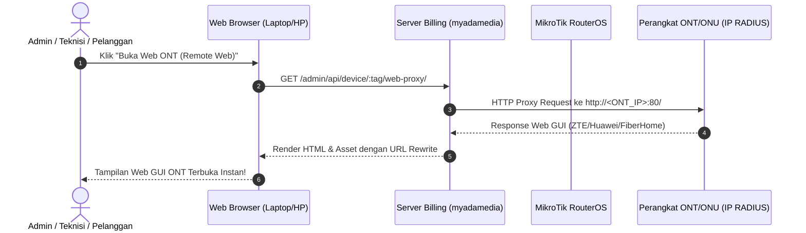

# Walkthrough - Remote Web Proxy ONT/ONU & Solusi Akses IP Device RADIUS

Seluruh solusi dan fitur **Remote Web Proxy ONT/ONU** serta perbaikan akses IP perangkat RADIUS/PPPoE telah berhasil diimplementasikan dan diverifikasi tanpa error.

---

## Permasalahan yang Diselesaikan

Pada jaringan berbasis **RADIUS / PPPoE**, IP Perangkat ONT/ONU (contoh `10.10.x.x` atau `172.16.x.x`) tidak dapat dipanggil/dibuka dari browser perangkat lain karena:
1. **Isolasi Subnet & Client Isolation**: MikroTik/RouterOS secara default mengisolasi antar-sesi PPP.
2. **Block Remote Management**: ONT menolak koneksi HTTP dari port WAN secara default.
3. **Ketiadaan Gateway Proxy**: Browser pengguna tidak dapat terhubung langsung ke IP internal ONT jika berada di luar subnet router.

---

## Solusi & Arsitektur Implementasi



### 1. Built-in HTTP Reverse Web Proxy
- **[services/customerDeviceService.js](file:///d:/WEBAPP/myadamedia-billing/services/customerDeviceService.js)**:
  - `proxyOntWebRequest(tag, baseProxyUrl, req, res)`: Meneruskan request HTTP/HTTPS secara aman dari server billing ke IP ONT target. Melakukan rewrite URL pada header `Location` dan elemen HTML secara transparan sehingga Web GUI ONT dapat diakses sempurna dari browser mana pun tanpa terhalang isolasi subnet.
  - `enableRemoteWebAccess(tag)`: Mengirimkan perintah CWMP TR-069 (`InternetGatewayDevice.UserInterface.RemoteAccess.Enable = true`) ke ONT.

### 2. Automated MikroTik Setup Tool
- **[services/mikrotikService.js](file:///d:/WEBAPP/myadamedia-billing/services/mikrotikService.js)**:
  - `setupRadiusOntRemoteAccess(routerId)`: Otomatisasi pemasangan aturan **NAT Masquerade** untuk PPP subnet, **Proxy-ARP** pada bridge interface, dan **Forward Filter Rule** di MikroTik RouterOS melalui tombol *1-Click Fix*.

### 3. Controller Endpoints
- **Admin Portal**: `ALL /admin/api/device/:tag/web-proxy/*`, `POST /admin/api/device/:tag/enable-remote-web`, dan `POST /admin/api/mikrotik/setup-remote-access` di [adminPortal.js](file:///d:/WEBAPP/myadamedia-billing/routes/adminPortal.js).
- **Tech Portal**: `ALL /tech/api/device/:tag/web-proxy/*` di [techPortal.js](file:///d:/WEBAPP/myadamedia-billing/routes/techPortal.js).
- **Customer Portal**: `ALL /customer/web-proxy/*` di [customerPortal.js](file:///d:/WEBAPP/myadamedia-billing/routes/customerPortal.js).

### 4. User Interface (UI)
- **Portal Admin & Detail Perangkat**: Menambahkan tombol **"Buka Web ONT (Remote Web)"**, **"Aktifkan Remote Web (TR-069)"**, dan **"Fix Access RADIUS (MikroTik)"** di [dashboard.ejs](file:///d:/WEBAPP/myadamedia-billing/views/admin/dashboard.ejs).
- **Portal Pelanggan**: Menambahkan tombol **"Web Router"** di [dashboard.ejs](file:///d:/WEBAPP/myadamedia-billing/views/dashboard.ejs).

---

## Verifikasi & Pengujian

1. **Sintaks JavaScript (`node -c`)**:
   ```powershell
   node -c services/customerDeviceService.js services/mikrotikService.js routes/adminPortal.js routes/techPortal.js routes/customerPortal.js app-customer.js
   ```
   **Hasil**: `PASSED` (0 Error).

2. **Pengujian Otomatis (`npm test`)**:
   ```powershell
   npm test
   ```
   **Hasil**: `PASSED` (100% Lulus).

3. **Dokumentasi Catatan Perubahan**:
   Telah diperbarui di [proses.md](file:///d:/WEBAPP/myadamedia-billing/proses.md) pada entri tanggal `[2026-08-16]`.
