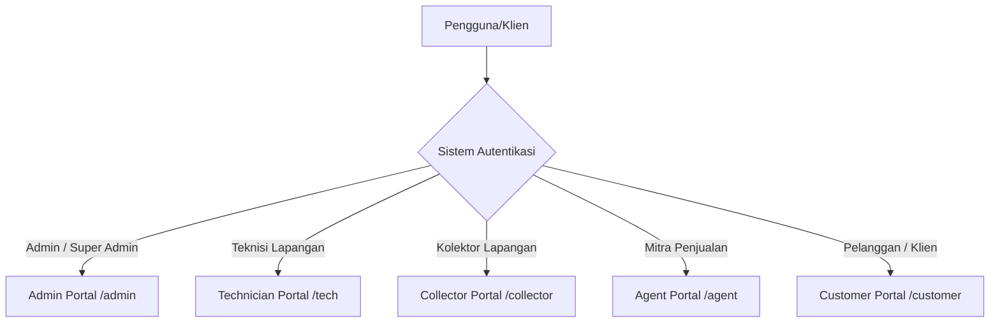

# Analisis Teknis & Struktur Sistem MyBilling3

Sistem ini adalah **RTRWNET Management & Billing System** (Portal Pelanggan GenieACS & Manajemen ISP) berbasis **Node.js (Express)**, **SQLite (better-sqlite3)**, dan **EJS**. Aplikasi dirancang sebagai solusi *all-in-one* untuk penyedia layanan internet (ISP) lokal dan jaringan RTRW-Net untuk mengelola pelanggan, tagihan, infrastruktur pasif/aktif, dan otomatisasi jaringan.

---

## 1. Arsitektur Utama & Portal Peran

Aplikasi ini menggunakan pola arsitektur **MVC (Model-View-Controller) Monolitik** yang memisahkan logika routing, layanan (*services*), dan presentasi (*views*). Sistem ini menyediakan 5 jenis portal terpisah untuk berbagai peran:



### Rincian Portal & Fungsionalitas:
*   **Admin / Super Admin Portal (`/admin`):** Kontrol penuh atas seluruh konfigurasi aplikasi, keuangan, manajemen OLT/MikroTik, paket internet, inventaris, database backup, dan audit log.
*   **Customer Portal (`/customer`):** *Self-service* bagi pelanggan untuk mengecek status isolir/aktif, melihat grafik trafik PPPoE real-time, mengubah SSID & password router via TR-069, membeli voucher, dan membuat tiket keluhan.
*   **Technician Portal (`/tech`):** Mengelola tiket gangguan, melihat peta ODP/pelanggan secara geografis dengan integrasi rute Google Maps, serta mendaftarkan pelanggan baru langsung di lapangan.
*   **Agent Portal (`/agent`):** Membantu agen lokal menjual voucher hotspot, membayar tagihan pelanggan menggunakan saldo deposit agen, dan bertransaksi produk digital (pulsa/paket data) via integrasi **Digiflazz**.
*   **Collector Portal (`/collector`):** Digunakan petugas penagih lapangan untuk mengecek tagihan dan menginput pengajuan pembayaran yang membutuhkan persetujuan (*approval*) admin.

---

## 2. Integrasi Perangkat & Jaringan

Salah satu nilai jual utama dari platform ini adalah integrasi mendalam dengan infrastruktur jaringan aktif:

### A. Built-in ACS (Auto Configuration Server) TR-069
Aplikasi ini dilengkapi dengan **internal CWMP/TR-069 server** (`services/acsServerService.js`).
*   **Mengapa ini penting?** Mengeliminasi kebutuhan server GenieACS/MongoDB eksternal yang memakan banyak RAM/CPU.
*   **Mekanisme Kerja:** CPE/Router pelanggan mengirimkan SOAP XML request via POST ke endpoint `/acs`. Sistem mem-parsing pesan SOAP XML menggunakan Regular Expression berkinerja tinggi (tanpa parser XML berat) dan memetakan respon ke perangkat di database `acs_devices`.
*   **Fitur:** Mengubah SSID, kata sandi Wi-Fi, melakukan reboot perangkat, mengonfigurasi parameter WAN secara massal (*bulk provisioning*), dan mendeteksi redaman sinyal optik (Optical RX Power).

### B. MikroTik RouterOS API
Menggunakan `routeros-client` (`services/mikrotikService.js`) untuk sinkronisasi konfigurasi PPPoE dan Hotspot secara real-time.
*   **PPPoE:** Otomatisasi pembuatan secret PPPoE baru, penonaktifan (isolir) pelanggan yang terlambat membayar, dan monitor trafik real-time.
*   **Hotspot & Voucher:** Membuat batch voucher hotspot, menyinkronkan profil kecepatan, dan ekspor kode voucher ke CSV.

### C. OLT PON (SNMP & REST API)
Mengelola Optical Line Terminal (OLT) via SNMP (`net-snmp`) atau delegasi REST API ke microservice eksternal (`onuProvisionService.js`).
*   Mendukung deteksi otomatis ONU baru (*ONU Authorization*).
*   Membaca status redaman port PON, serta memantau kesehatan hardware OLT.

---

## 3. Otomatisasi Berbasis Waktu (Cron Jobs)

Aplikasi memiliki manajemen tugas latar belakang yang sangat disiplin di `services/cronService.js` untuk menjalankan proses operational harian otomatis:

| Waktu Eksekusi | Nama Tugas | Fungsi & Alur Logika |
| :--- | :--- | :--- |
| **Setiap Tanggal 1 (00:01)** | `Generate Tagihan Bulanan` | Otomatis membuat invoice tagihan baru untuk semua pelanggan aktif, mendukung perhitungan harga promo serta prorata (proporsional hari pasang). |
| **Setiap Hari (02:00)** | `Isolir Otomatis` | Memeriksa pelanggan aktif yang memiliki tagihan belum lunas dan telah melewati tanggal jatuh tempo (`isolate_day`). Pelanggan akan otomatis dinonaktifkan di MikroTik. |
| **Setiap Hari (09:00)** | `WhatsApp Billing Reminder` | Mengirim notifikasi pengingat tagihan otomatis H-1 dari hari jatuh tempo menggunakan jeda acak (*smart random delay*) untuk menghindari blokir nomor oleh WhatsApp. |
| **Setiap Hari (00:00 & 06:00)** | `Jam Kalong (Night Speed)` | Mengubah profil kecepatan PPPoE secara dinamis (misal: memberikan bandwidth lebih besar pada malam hari) dan mengembalikannya ke kecepatan normal saat pagi hari. |
| **Setiap 10 Menit** | `Usage Tracking` | Mengambil statistik pemakaian bandwidth data (`bytes-in`/`bytes-out`) dari sesi PPPoE aktif di MikroTik dan mencatatnya ke database untuk riwayat pemakaian bulanan. |
| **Setiap Jam** | `FUP (Fair Usage Policy)` | Memeriksa total pemakaian bulanan pelanggan. Jika telah melebihi batas kuota FUP paketnya, kecepatan pelanggan akan otomatis diturunkan di MikroTik. |

---

## 4. Keamanan & Stabilitas Backend

Sistem ini menerapkan beberapa praktik pengodean defensif (*defensive coding*) untuk memastikan kelangsungan server 24/7:

1.  **Proteksi CSRF Tanpa Overhead:**
    Menggunakan middleware kustom di `app-customer.js` yang memeriksa kecocokan `Origin` / `Referer` dengan host server untuk metode mutasi (`POST`, `PUT`, `DELETE`). Ini mengamankan form HTML dari eksploitasi CSRF tanpa memerlukan tokens session tambahan yang rumit di EJS template. Webhook eksternal dan port ACS dikecualikan secara selektif.
2.  **Uncaught Exception Handler:**
    ```javascript
    process.on('uncaughtException', (err) => {
      logger.error(`uncaughtException: ${err.stack}`);
      // Menjaga agar server tidak crash saat API MikroTik / OLT timeout
    });
    ```
    Karena kegagalan koneksi MikroTik atau OLT sering kali memicu *crash* tak terduga pada library jaringan, penanganan global ini memastikan proses Node.js tetap berjalan untuk melayani pelanggan lainnya.
3.  **Smart Rate Limiting & Retry on WhatsApp:**
    Pada cron pengiriman WhatsApp, sistem menggunakan delay dinamis (`getRandomDelay`), exponential backoff jika pengiriman gagal, pembagian batch pengiriman (jeda 2 menit setelah 15 pesan), dan penambahan variasi karakter tak terlihat pada pesan untuk mengelabui deteksi anti-spam WhatsApp.

---

## 5. Antarmuka (CSS & UI/UX Styling)

Gaya visual untuk panel admin didefinisikan di `public/css/admin.css` dengan standar desain modern:

*   **Variabel CSS & Tema:** Menampung token desain untuk warna latar belakang, batas, warna utama, status sukses/gagal, dan lebar *sidebar*. Mendukung 4 tema bawaan:
    *   `Default/Dark Theme` (Kombinasi warna gelap ala GitHub: `#0d1117`, `#161b22`)
    *   `Light Theme` (Warna terang bersih: `#f8fafc`, `#ffffff`)
    *   `Ocean Theme` (Warna biru laut gelap dengan accent cyan)
    *   `Forest Theme` (Warna hijau hutan gelap dengan accent hijau kekuningan)
*   **Desain Responsif:** Menyediakan layout *grid* dinamis untuk statistik, dan transisi ke menu *sidebar* geser serta *bottom navigation bar* saat dibuka lewat handphone (resolusi layar di bawah `992px` dan `768px`).
*   **Money Blur (Fitur Privasi Kasir/Admin):**
    ```css
    .hide-money .money-value { filter: blur(5px) !important; }
    .hide-money .money-value:hover { filter: none !important; }
    ```
    Menambahkan blur pada angka nominal keuangan di dashboard/laporan untuk menjaga kerahasiaan saat layar admin diproyeksikan atau dilihat oleh orang lain, dan nilainya akan tampil secara instan saat kursor diarahkan (*hover*).
